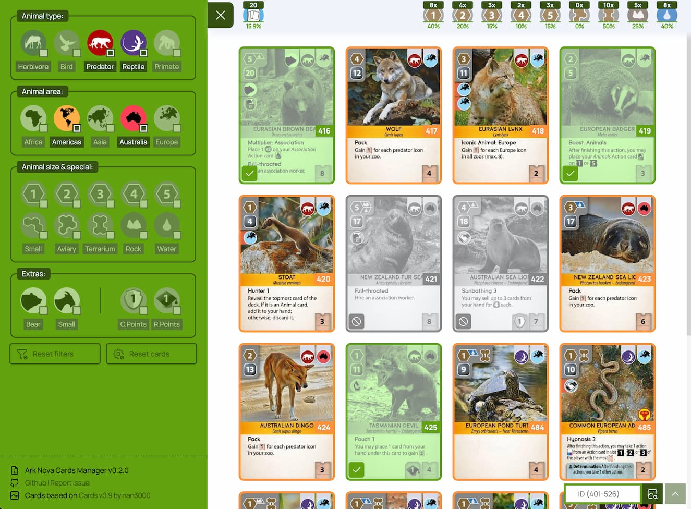

# Ark Nova Cards Manager
> [https://pixelt.github.io/ArkNovaCardsManager/](https://pixelt.github.io/ArkNovaCardsManager/)

Simple app to managing & filtering cards available in Ark Nova boardgame:
- use options in left sidebar to filtering cards based on selected values
- click / tap on card to change card status (cards statuses are saved afer reload the page)
- use search in top right corner to display card with a specifid ID (401-526)
- use reset buttons to reset selected filters / cards statuses

Built with [SimpleStarterPack](https://github.com/PixelT/SimpleStarterPack)