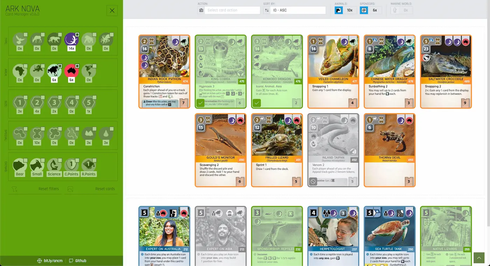

# Ark Nova Cards Manager

> URL (default): [https://arknova.cards](https://arknova.cards)

### About app
Simple app to managing and filtering animals & sponsors cards available in Ark Nova boardgame (includes Marine World expansion):
- use options in left sidebar to filtering cards based on selected values
- click / tap on card to change card status (cards statuses are saved afer reload the page)
- use topbar options to filter cards by type / action or sort by predefined value
- use reset buttons to reset selected filters / cards statuses

### Innovations in v0.6.x
- support for `Marine Worlds` expansion
- refreshed look of the application
- better support for mobile devices
- removed statistic panel - now statistics are displayed directly in filter panel
- removed search option in the bottom
- UX improvement for `Action` filter
- new `Sort by` option

Built with [SimpleStarterPack](https://github.com/PixelT/SimpleStarterPack)